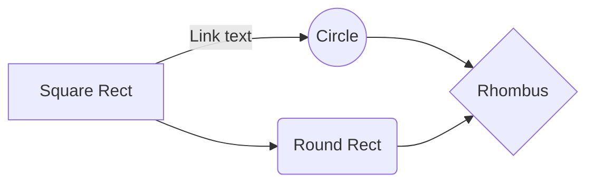

And this will produce a flow chart:

Картинки-сноски:

![Картинка][image1]
![Картинка][image2]
![Картинка][image3]

[image1]: //placehold.it/200x100
[image2]: //placehold.it/150x100
[image3]: //placehold.it/100x100

---

This is an [example link](http://example.com/ "With a Title").

https://github.github.com/gfm/#blank-line

<a href="/uri" title="title">link</a>

<a href="mailto:foo@bar.example.com">foo@bar.example.com</a>

A paragraph with two lines.

<pre><code>indented code
</code></pre>
<blockquote>

A block quote.

</blockquote>

<pre><code>
          ***
</code></pre>

_ _ _ _ a

a------

---a---

<pre><code>aaa
~~~
</code></pre>

<pre><code class="language-ruby">def foo(x)
  return 3
end
</code></pre>

<table><tr><td>
<pre>
**Hello**,

<em>world</em>.
</pre>

</td></tr></table>

<table>
  <tr>
    <td>
           hi
    </td>
  </tr>
</table>

okay.

<em>Markdown</em>

> [!NOTE]
> Highlights information that users should take into account, even when skimming.

> [!TIP]
> Optional information to help a user be more successful.

> [!IMPORTANT]
> Crucial information necessary for users to succeed.

> [!WARNING]
> Critical content demanding immediate user attention due to potential risks.

> [!CAUTION]
> Negative potential consequences of an action.

